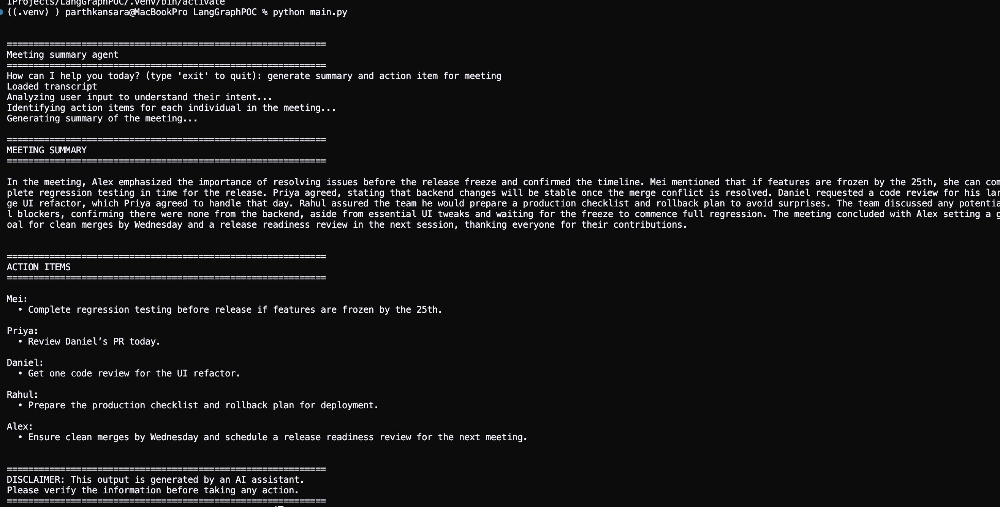

## Prerequisites

- Python 3.12
- OpenAI API Key ([Get one here](https://platform.openai.com/api-keys))
- Windows PowerShell or Git Bash (for commands below)

## Quick Start

1. Navigate to Project root folder.
2. Open "cmd" / "terminal"
3. Create virtual enviornment: `python -m venv venv`
4. Activate virtual enviornment: `venv\Scripts\activate`
5. Install dependencies: `pip install -r requirements.txt`
6. Setup enviornment variables: `cp .env.example .env`
7. Run program: `python main.py`

## Project Structure

```text
meeting-summary-assistant/
├── .env.example
├── README.md
├── agents/
│   ├── actionAgent.py
│   ├── combineAgent.py
│   ├── summaryAgent.py
│   └── supervisorAgent.py
├── config.py
├── formatter.py
├── graph.py
├── main.py
├── requirements.txt
├── state.py
└── transcript.txt
```

- **`agents/`** – core agent modules; each implements a different role/task.
- **`config.py`**, **`state.py`**, **`formatter.py`**, **`graph.py`** – shared utilities and configuration.
- **`main.py`** – entry point orchestrating the agents.
- **`.env.example`** – environment variable template.
- **`requirements.txt`** – Python dependencies.
- **`transcript.txt`** – sample input data.

## Working example



## License

[MIT](./LICENSE) License © 2026-PRESENT [Parth Kansara](https://github.com/kparth01)


## Create Python env:
`python3 -m venv .venv`

Activate:
`.venv\Scripts\activate`

## Install Graphify:
Go to terminal install graphifyy:
`pip install --upgrade graphifyy`

Link the skill to VSCode. It will create a .github folder:
`graphify vscode install` 

Without API Key use these commands to create graph for code only:
`graphify extract . --code-only`

To generate GRAPH_REPORT.md and name communities
`graphify cluster-only /Users/parth.kansara/Projects/AIProjects/MeetingSummaryAgent/agentic-ai-meeting-summary-agent` 

Verify if you workspace have graphifyy installed:
`graphify query`
Oupput:
`Usage: graphify query "<question>" [--dfs] [--context C] [--budget N] [--graph path]`